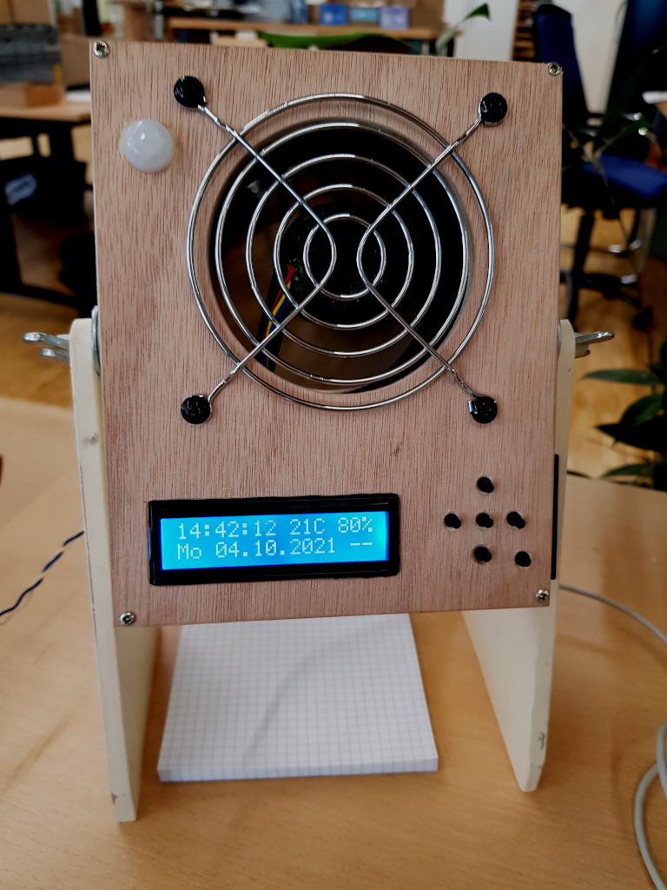

# kleinCooler
Der kleinCooler ist ein Tischventilator der nach der Idee von Herrn Klein durch mich entwickelt
und umgesetzt wurde. Die Grundidee war einfach: Ein Ventilator der nur läuft wenn der Mitarbeiter
am Arbeitsplatz ist.
Wie das mit so Projekten häufig geht ist das Projekt immer mehr gewachsen und wurde dann
wieder verkleinert um es zu Ende zu bringen. Nun ist es ein kippbarer Ventilator mit
multifunktionaler Uhr, Wecker, Timer und verschiedenen Klingeltoenen.

# Schema

